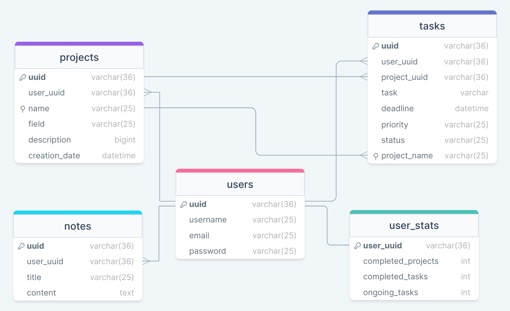

<!-- 
# TaskMate
TaskMate is a web application built with React.js, Node.js, and Express.js for managing individual projects. The application provides an intuitive interface for creating, updating, and deleting projects and tasks. Users can also filter and sort them by various criteria, add projects to favourites and mark tasks as done.

## Database
This project uses a remote MySQL database for storing data. The database configuration details are stored in the .env file, which should not be committed to the repository for security reasons.

## Database Scheme


## Requirements
Before running the application, you need to have Node.js and npm installed on your system. You can download the latest version of Node.js from the [**offical website**](https://nodejs.org/).

## Installation
To install the application, follow these steps:

1- Clone the repository: 

```bash
git clone https://github.com/Iskenderun-Technical-University/mustafazeydani-VDGP.git
```

2- Install the dependencies:

```bash
cd mustafazeydani-VDGP
npm install
```

## Usage
To run the application, follow these steps:

1- Start the server:

```bash
cd server
npm start
```

This will start the server on **http[]()://localhost:8800**.

2- Start the client:

```bash
cd client
npm start
```
This will start the client on **http[]()://localhost:3000**.

3- Open **http[]()://localhost:3000** in your web browser to access the application.

## Feedback

If you have any feedback, please reach out to me at mustafamari20@gmail.com.
 -->
